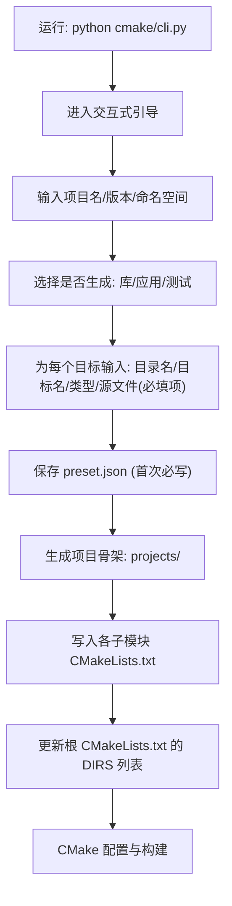
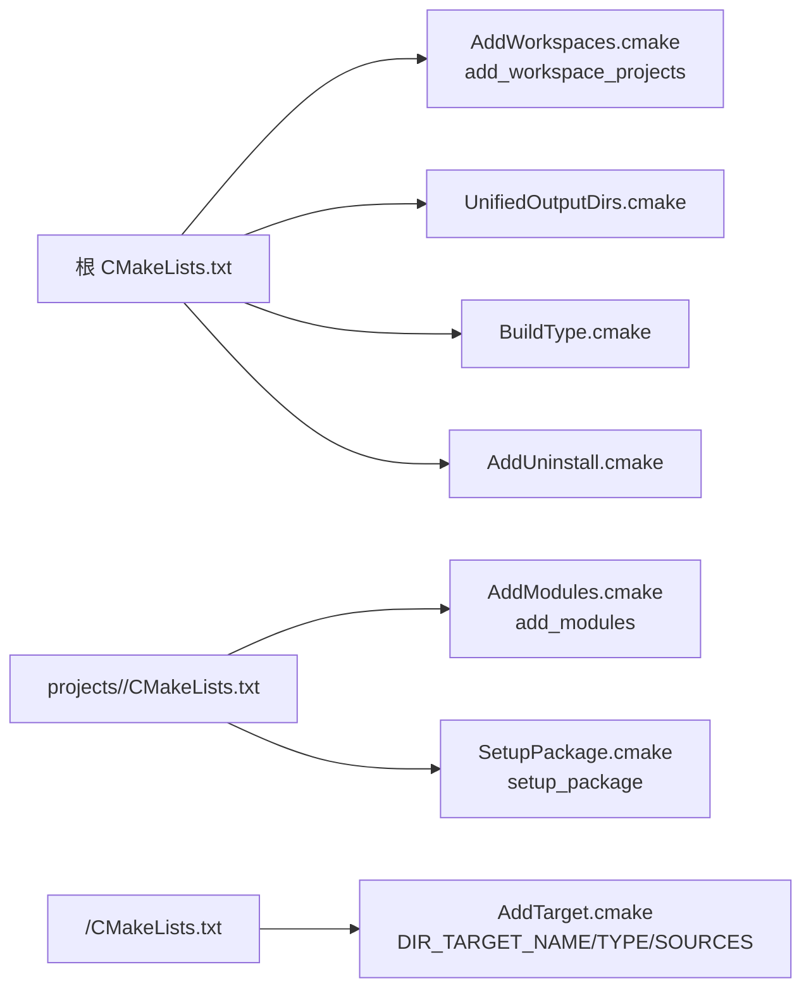
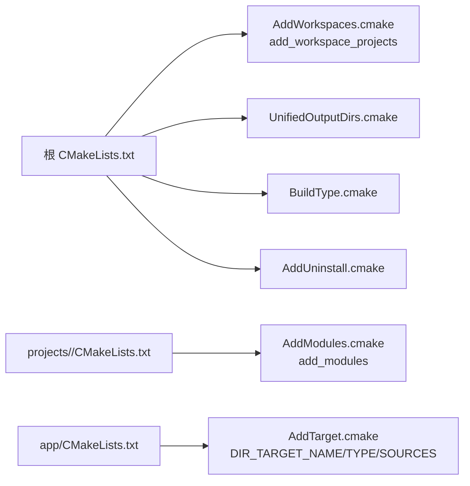
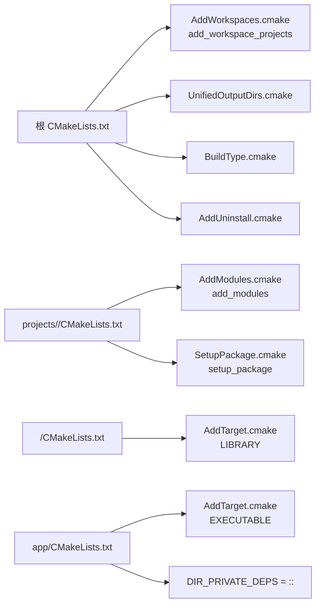
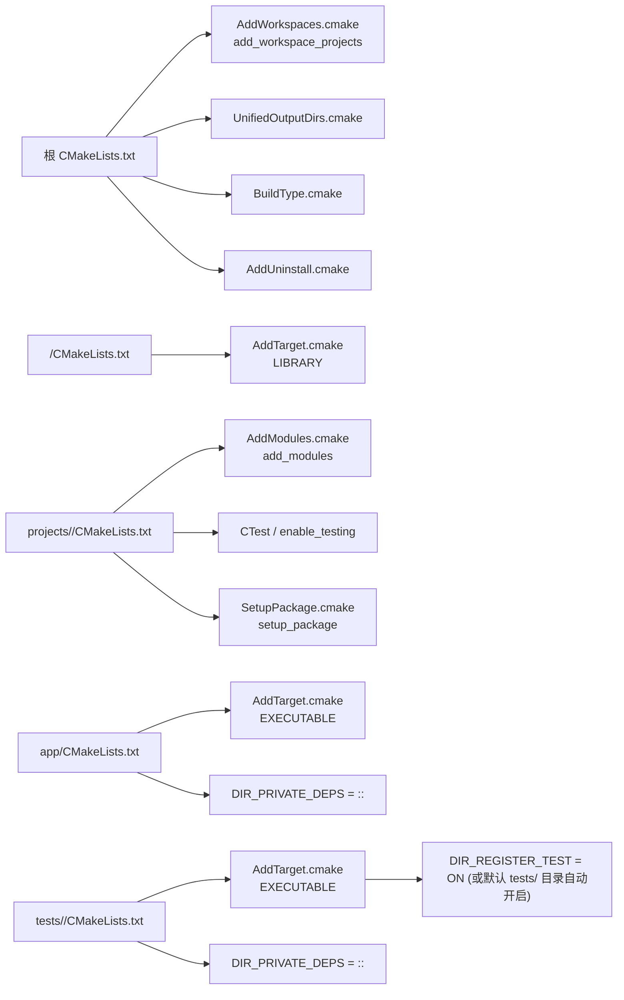
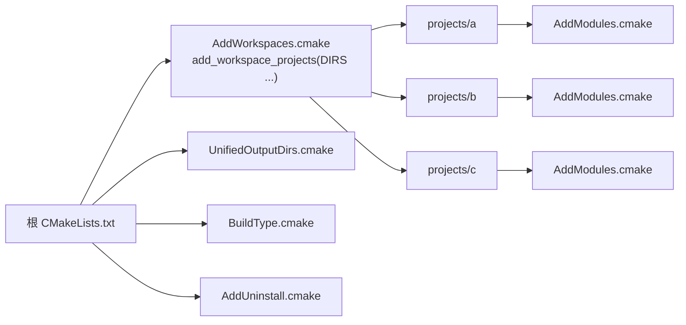

# 图示化说明

## 1) `cmake/cli.py` 引导步骤（流程图）

## 2) 基于 `cmake/` 的不同项目架构与所需函数（结构图）

### 2.1 仅库（Library-Only）

### 2.2 仅应用（App-Only）

### 2.3 库 + 应用（Library + App）

### 2.4 库 + 应用 + 测试（Library + App + Tests）

### 2.5 多工作区聚合（Multi-Workspace）

## 说明
- 以上图示对应本仓库 `cmake/` 中的模块分工与调用关系。
- 所有目标必须显式设置 `DIR_SOURCES`（最小化重新配置与重编译）。
